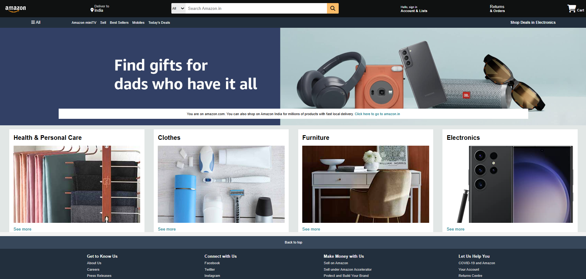

# Amazon Clone

A responsive front-end clone of the Amazon homepage built using **HTML** and **CSS**. This project focuses on recreating the visual design and layout of Amazon while improving front-end development skills.

## 🚀 Live Preview

Add your deployed link here:

```text
https://krishnaa-kumar.github.io/Amazon-Clone/
```

## 📌 Project Overview

This project is a static clone of Amazon's homepage created using only HTML and CSS. It replicates the overall structure, styling, navigation bar, hero section, product categories, and footer design of the original website.

⚠️ **Note:** This project does not use JavaScript. Therefore, features such as search functionality, cart operations, login systems, and other dynamic interactions are not functional and are included only for UI demonstration purposes.

## ✨ Features

* Responsive Amazon-inspired layout
* Navigation bar with logo and menu sections
* Search bar design
* Hero banner section
* Product category cards
* Footer section similar to Amazon
* Clean and organized code structure
* Pure HTML and CSS implementation

## 🛠️ Technologies Used

* HTML5
* CSS3

## 📂 Project Structure

```text
Amazon-Clone/
│
├── index.html
├── style.css
├── assets/
│   ├── images
│   └── icons
└── README.md
```

## 📸 Screenshots



## 🔧 Installation

1. Clone the repository

```bash
git clone https://github.com/Krishnaa-Kumar/Amazon-Clone.git
```

2. Open the project folder

```bash
cd Amazon-Clone
```

3. Run the project

Simply open `index.html` in your browser.

## 🎯 Learning Outcomes

Through this project, I learned:

* HTML page structuring
* CSS Flexbox and layout design
* Responsive web design basics
* UI cloning techniques
* Front-end development best practices

## 🤝 Contributing

Contributions, suggestions, and improvements are welcome.

1. Fork the repository
2. Create a new branch

```bash
git checkout -b feature-name
```

3. Commit your changes

```bash
git commit -m "Add new feature"
```

4. Push the branch

```bash
git push origin feature-name
```

5. Open a Pull Request

## 👨‍💻 Author

Krishna Kumar

GitHub: https://github.com/Krishnaa-Kumar

## ⭐ Support

If you like this project, consider giving it a star on GitHub.

---

Made with ❤️ using HTML & CSS.
